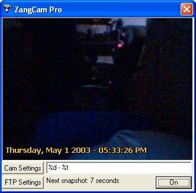



## ZangCam Pro Web Cam

### Description

ZangCam Pro is a web cam client. I use the word 'client' because, unlike a web cam server, ZangCam Pro doesn't accept direct incoming connections to view the pictures. Instead, it takes a picture every 10 seconds and uploads it to an FTP server. The user configures what FTP server to use. Supports writing text along the bottom of the picture, and uses 'backreferences' for date and time (%d for date, %t for time). Ideal for users that want to publish a web cam to their web site from behind a firewall, but don't want to pay for special software and hosting. PLEASE NOTE: This code is only about 75% mine. I didn't know how to convert BMP files to JPEGs and there was no code on PSC for how to do this, so I used some vbAccelerator source code. This software also uses the Shrinkwrap VB ezVidCap component for VB6, also included in the project. If you like it, please vote. If nothing else, leave a comment saying how I could improve it. I will continuously update this software and add features. By the way, my web cam (which uses ZangCam Pro) can be viewed at http://www.imp-lan.com/ultimatum/webcam.htm
 
### More Info
 

             |
---                |---
**Submitted On**   |2003-05-01 17:46:46
**By**             |[Jonathan Smith](https://github.com/Planet-Source-Code/PSCIndex/blob/master/ByAuthor/jonathan-smith.md)
**Level**          |Intermediate
**User Rating**    |5.0 (15 globes from 3 users)
**Compatibility**  |VB 6\.0
**Category**       |[Complete Applications](https://github.com/Planet-Source-Code/PSCIndex/blob/master/ByCategory/complete-applications__1-27.md)
**World**          |[Visual Basic](https://github.com/Planet-Source-Code/PSCIndex/blob/master/ByWorld/visual-basic.md)
**Archive File**   |[ZangCam\_Pr158189512003\.zip](https://github.com/Planet-Source-Code/jonathan-smith-zangcam-pro-web-cam__1-45172/archive/master.zip)

